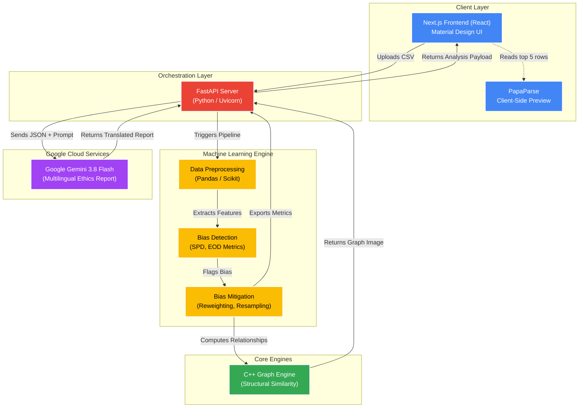

<div align="center">
  
  
  # 🛡️ AlgoGuard AI
  **Democratizing AI Equity for the Global South** <br>
  *Built for the Google Developer Groups (GDG) Solution Challenge 2026*
  
  [](https://gdg-solution-challenge-arghyadevs.vercel.app/)
  [](https://gdg-solution-challenge-rybg.onrender.com/docs)
  
  <br>
  
  
  
  
  
  

  ---
</div>

## 🌟 Overview
Machine learning models often inherit historical biases based on attributes like Gender, Age, or Race. **AlgoGuard AI** tackles this problem by identifying instances of bias, measuring it mathematically, actively mitigating it using algorithmic strategies, and mapping out the structural isolation of demographic groups using graph theory.

To bridge the gap between engineering and compliance, we use **Google Gemini 3.8 Flash** to translate complex statistical mathematics into plain-English (and multilingual) AI Ethics Reports.

---

## 🚀 Live Demonstration
The platform is fully functional and live on the internet!
- **Frontend Dashboard:** [AlgoGuard AI on Vercel](https://gdg-solution-challenge-arghyadevs.vercel.app/)
- **Backend API Docs:** [FastAPI Swagger UI](https://gdg-solution-challenge-rybg.onrender.com/docs)

---

## 💡 Opportunities & Unique Selling Proposition (USP)

### How different is it from existing ideas?
Enterprise bias mitigation tools (like IBM's AI Fairness 360) are highly complex, command-line Python libraries designed strictly for PhD-level data scientists. **AlgoGuard AI disrupts this** by providing a "No-Code", Google Material Design web dashboard. Non-technical stakeholders (auditors, product managers) can simply upload a CSV and instantly visualize AI bias.

### How does it solve the problem?
AlgoGuard AI goes beyond merely *detecting* bias; it actively *solves* it:
1. **Mathematical Mitigation:** Uses a custom C++ Structural Engine and Resampling techniques to mathematically rebalance biased datasets *before* they are deployed.
2. **AI Translation:** Utilizes Google Gemini 3.8 Flash as an "AI Ethics Officer" to translate statistical mathematics into readable compliance reports.

### The USP
> **"Hyper-Accessible, Multilingual Algorithmic Equity."** 

Unlike Western-centric tools, AlgoGuard AI natively generates technical AI Ethics Reports in regional languages (**Hindi, Bengali, Tamil, Telugu**). By leveraging Gemini's multilingual capabilities, we democratize AI safety for massive, diverse populations across India.

---

## 🏗️ System Architecture



---

## 🛠️ Technologies Used

### 💻 Frontend
*   **Next.js 16 (React):** High-performance framework for building the reactive dashboard.
*   **Tailwind CSS v4:** Used for rapid, responsive UI styling and layout constraints.
*   **Google Material Design 3:** Strict adherence to official Google design tokens.

### ⚙️ Backend & Orchestration
*   **FastAPI:** Lightning-fast Python web framework exposing the `/api/analyze` endpoint.
*   **Uvicorn:** High-performance ASGI server handling concurrent API requests.

### 🧠 Machine Learning Engine
*   **Scikit-Learn & Pandas:** Core framework for Baseline Model training and Data Preprocessing.
*   **Imbalanced-Learn:** Utilized for `RandomUnderSampler` to execute Bias Mitigation.
*   **NetworkX & Matplotlib:** Used to visually plot complex bias relationship clusters.

### ⚡ Core Computing Engine
*   **C++:** High-speed, low-level execution engine (`graph.cpp`) to rapidly calculate structural similarity graphs.

### ☁️ Google Cloud Services
*   **Google Gemini 3.8 Flash API:** Integrated via the `google-genai` SDK to dynamically translate and generate multilingual ethics reports.

---

## 🏃‍♂️ Running Locally

1. **Backend:**
```bash
python3 -m venv venv
source venv/bin/activate
pip install -r requirements.txt
g++ -O3 graph.cpp -o g.exe
uvicorn api_server:app --port 8000 --reload
```

2. **Frontend:**
```bash
cd frontend
npm install
npm run dev
```

Visit `http://localhost:3000` to view the dashboard!
